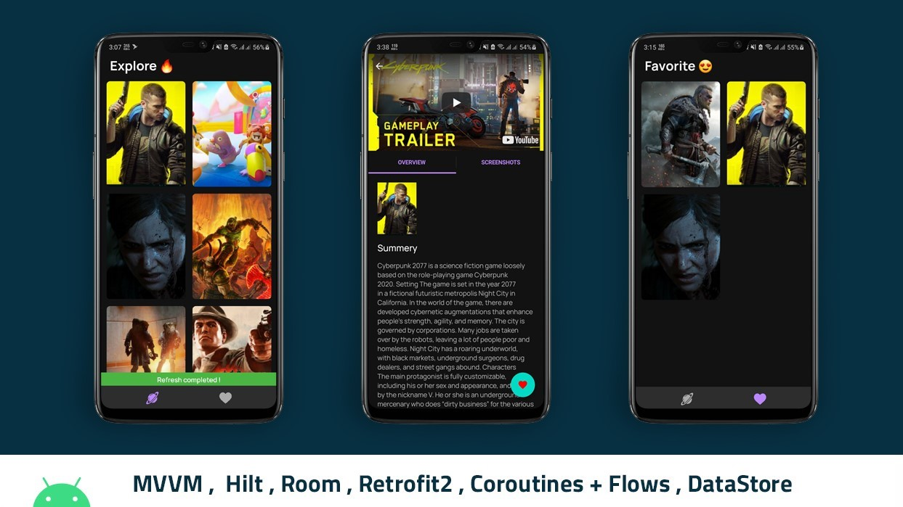

<h1 align="center">Games Keeper 🎮</h1>

<p align="center">  
[In progress...]An Android app consuming a RAWG Video Games Database API to display tranding games it has been built with clean architecture principles, Repository Pattern and MVVM pattern as well as Architecture Components.
</p>

<p align="center">
Min Api Level : 21 Supports Over 87% Devices
<p/>
<p align="center">

</p>

<br/>

## Overview
|   Pagination   | Perallel Request | Error Handle |
|     :---:      |     :---:      |     :---:      |
|      |      |      |

<br/>

## API
Go to the [Explore RAWG Video Games Database API](https://rawg.io/apidocs) to explore api.

## Tech stack & Open-source libraries

- 100% [Kotlin](https://kotlinlang.org/) based, [Coroutines](https://github.com/Kotlin/kotlinx.coroutines) + [Flow](https://kotlin.github.io/kotlinx.coroutines/kotlinx-coroutines-core/kotlinx.coroutines.flow/) for asynchronous.
- [BaseActivity](https://github.com/Musfick/GamesKeeper/blob/master/app/src/main/java/com/foxhole/gameskeeper/base/BaseActivity.kt) - for activity code reuse.
- [BaseFragment](https://github.com/Musfick/GamesKeeper/blob/master/app/src/main/java/com/foxhole/gameskeeper/base/BaseFragment.kt) - for fragment code reuse.
- [BaseRecyclerViewAdapter](https://github.com/Musfick/GamesKeeper/blob/master/app/src/main/java/com/foxhole/gameskeeper/base/BaseRecyclerViewAdapter.kt) - for recyclerview code reuse.
- [BaseDao](https://github.com/Musfick/GamesKeeper/blob/master/app/src/main/java/com/foxhole/gameskeeper/base/BaseDao.kt) - for dao code reuse.
- [Hilt](https://developer.android.com/training/dependency-injection/hilt-android) (alpha) for dependency injection.🗡️
- JetPack🚀
  - View Binding - View binding is a feature that allows you to more easily write code that interacts with views.
  - LiveData - notify domain layer data to views.
  - Lifecycle - dispose of observing data when lifecycle state changes.
  - ViewModel - UI related data holder, lifecycle aware.
  - Room Persistence - construct a database using the abstract layer.
  - DataStore - dataStore uses Kotlin, Coroutines and Flow to store data asynchronously with consistency and transaction support 😍
  - Advanced Navigation Component - bottom navigation with navigation component
  - Paging 3 - paging library helps you load and display pages of data from a larger dataset from local storage or over network.
- [Retrofit2 & OkHttp3](https://github.com/square/retrofit) - construct the REST APIs and paging network data.
- [Gson](https://github.com/google/gson) - Gson is a Java library that can be used to convert Java Objects into their JSON representation.
- [coil](https://github.com/coil-kt/coil) - an image loading library for Android backed by Kotlin Coroutines.
- [okhttp-logging-interceptor](https://github.com/square/okhttp/blob/master/okhttp-logging-interceptor/README.md) - logs HTTP request and response data.
- [kotlinx.coroutines](https://github.com/Kotlin/kotlinx.coroutines) - Library Support for coroutines,provides `runBlocking` coroutine builder used in tests
- [Youtube Player](https://github.com/PierfrancescoSoffritti/android-youtube-player) - android-youtube-player is a stable and customizable open source YouTube player for Android.
- [jsoup](https://jsoup.org/download) - jsoup is a Java library for working with real-world HTML
- [SmartTabLayout](https://github.com/ogaclejapan/SmartTabLayout) - A custom ViewPager title strip which gives continuous feedback to the user when scrolling
- [Timber](https://github.com/JakeWharton/timber) - logging.
- [Truth](https://truth.dev/) - Assertions Library,provides readability as far as assertions are concerned

## Architecture
- MVVM Architecture (View - DataBinding - ViewModel - Model)
- Repository pattern


## MAD Score


## Testing
[In progress...]

## Contributors
Feel free to contribute in any way to the project from typos in docs to code review are all welcome.

## License

 ```
   Copyright 2021 Musfick Jamil
   
   Licensed under the Apache License, Version 2.0 (the "License");
   you may not use this file except in compliance with the License.
   You may obtain a copy of the License at

       http://www.apache.org/licenses/LICENSE-2.0

   Unless required by applicable law or agreed to in writing, software
   distributed under the License is distributed on an "AS IS" BASIS,
   WITHOUT WARRANTIES OR CONDITIONS OF ANY KIND, either express or implied.
   See the License for the specific language governing permissions and
   limitations under the License.
 ```

